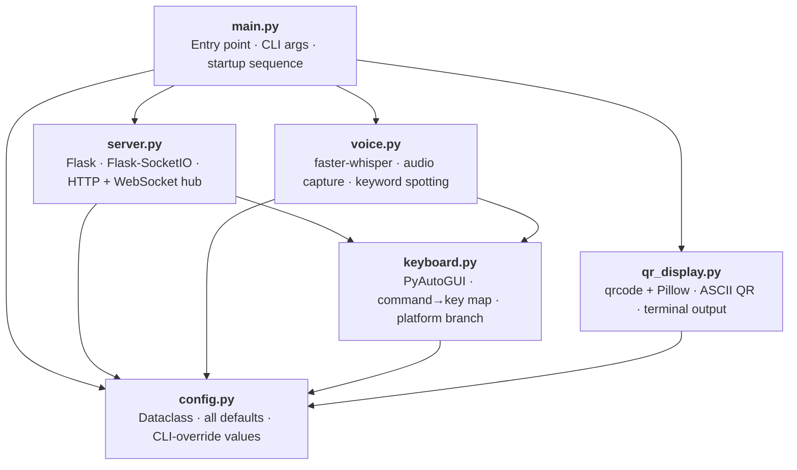

# SlideCommander — Module Dependency Graph

**Task ref:** 2.1 · **Phase:** Design · **Created:** 2026-05-22

---

## Architectural Summary

SlideCommander is organised as a strict **layered dependency tree** with six Python modules.
Each layer may only import from layers below it; no module ever imports from a module at the
same level or above it. This single rule makes circular imports structurally impossible.

| Layer | Module | Role |
|---|---|---|
| 0 — Foundation | `config.py` | Immutable dataclass holding every runtime value (port, model path, flags). Imported by everyone; imports nothing from the project. |
| 1 — Leaf workers | `keyboard.py` | Translates command names (`"next"`, `"back"`, …) to OS key-press events via PyAutoGUI. Knows nothing about networking or voice. |
| 1 — Leaf workers | `qr_display.py` | Generates and prints the terminal ASCII QR code. Needs only the server URL from Config. |
| 2 — Input handlers | `voice.py` | Captures microphone audio, runs faster-whisper keyword spotting, and calls `keyboard.execute()` directly on a match. Does **not** import `server.py`. |
| 2 — Input handlers | `server.py` | Runs the Flask + Flask-SocketIO HTTP/WebSocket server. Receives button-press events from the phone and calls `keyboard.execute()`. Does **not** import `voice.py`. |
| 3 — Entry point | `main.py` | Parses CLI args, builds a `Config`, starts `server`, starts `voice` in a background thread, prints the QR code, then blocks until shutdown. Imports every other module but is imported by none. |

Both input handlers (`voice.py` and `server.py`) converge on `keyboard.py` as the **single
command executor**. This means every slide action — whether triggered by a button tap or a
spoken word — travels through one code path, making the key-press logic easy to test in
isolation.

---

## Dependency Diagram



**Legend:** Arrow `A → B` means *A imports B* (A depends on B).

---

## Import Table

| Module | Imports from project |
|---|---|
| `config.py` | *(nothing)* |
| `keyboard.py` | `config` |
| `qr_display.py` | `config` |
| `voice.py` | `keyboard`, `config` |
| `server.py` | `keyboard`, `config` |
| `main.py` | `server`, `voice`, `qr_display`, `config` |

---

## DAG Verification

A graph is acyclic if and only if a valid **topological ordering** exists.
The ordering below satisfies every edge (each module appears before everything that imports it):

```
config  →  keyboard  →  qr_display  →  voice  →  server  →  main
```

Checking every edge against this ordering:

| Edge | Earlier → Later? |
|---|---|
| `keyboard` → `config` | ✅ |
| `qr_display` → `config` | ✅ |
| `voice` → `keyboard` | ✅ |
| `voice` → `config` | ✅ |
| `server` → `keyboard` | ✅ |
| `server` → `config` | ✅ |
| `main` → `server` | ✅ |
| `main` → `voice` | ✅ |
| `main` → `qr_display` | ✅ |
| `main` → `config` | ✅ |

**Result: Zero circular imports. Graph is a valid DAG.**

---

## How Circular Dependencies Were Avoided

Three design decisions eliminate the risk entirely:

1. **`config.py` is a pure data module.**  
   It contains only a dataclass with fields and defaults — no logic, no imports from the
   project. Every module can safely import it without risk of a chain forming.

2. **`voice.py` calls `keyboard.py` directly instead of importing `server.py`.**  
   The naive alternative — having `voice.py` emit a WebSocket event through `server.py` to
   trigger a key-press — would create the chain `voice → server → keyboard` plus a potential
   back-edge if the server ever needed to query voice state. By keeping voice-to-key as a
   direct call, `voice.py` has no knowledge of the network layer. Any optional "voice command
   detected" broadcast to the phone UI is handled by injecting a callback from `main.py`
   at startup, not by a module-level import.

3. **`main.py` is the sole orchestrator and is imported by nothing.**  
   All wiring (passing Config, starting threads, binding callbacks) happens inside `main.py`.
   This means no other module needs to reach "up" to the entry point, which is the most
   common source of circular imports in single-file-grown codebases.

---

*SlideCommander docs — module_diagram.md · Phase 2.1*
